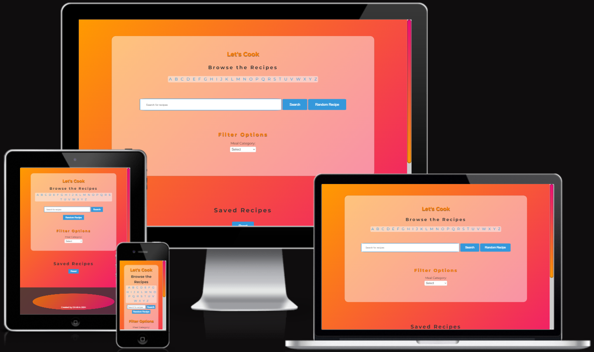
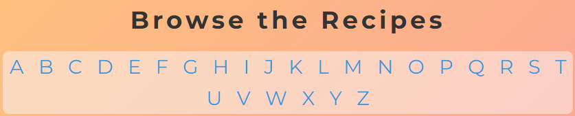
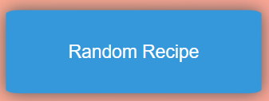
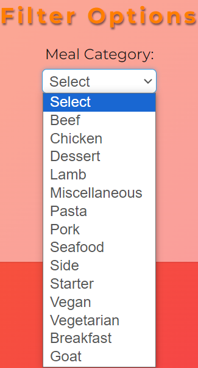
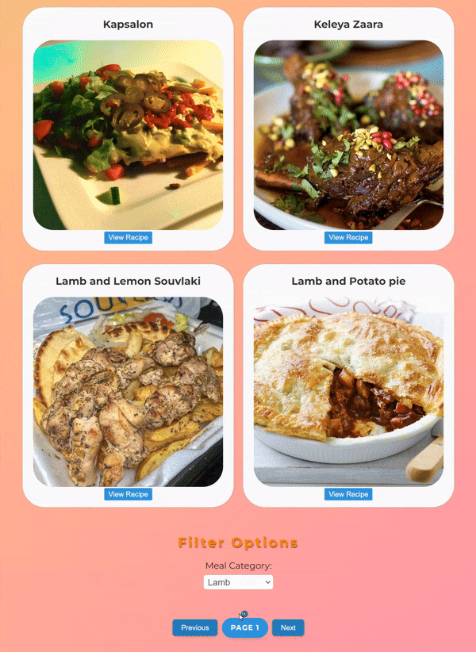
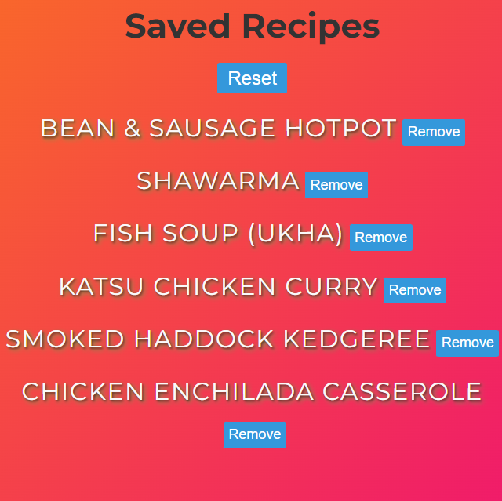
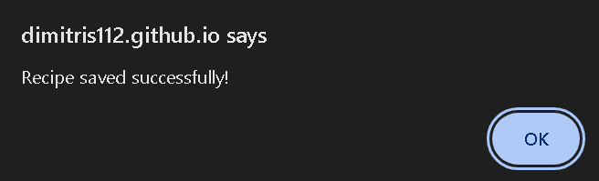
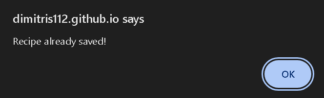
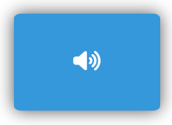

# Let's Cook
Go to the website -> [Live link](https://dimitris112.github.io/lets-cook-pp2/ "target=_blank")

- ## [Purpose of the project](#purpose-of-the-project)
- ## [User Stories](#user-stories)
- ## [Features](#features)
- ## [Future Features](#future-features)
- ## [Typography and color scheme](#typography-and-color-scheme)
- ## [Technology](#technology)
- ## [Testing](#testing)
    - [Code Validation](#code-validation)
    - [Test cases](#test-cases)
    - [Fixed bugs](#fixed-bugs)
    - [Unfixed bugs](#unfixed-bugs)
    - [Supported screens and browsers](#supported-screens-and-browsers)
- ## [Deployment](#deployment)
    - [Gitpod](#via-gitpod)
    - [Github Pages](#via-github-pages)
- ## [Credits](#credits)
    - [General](#general)
    - [Media](#media)

# Purpose of the project
- The purpose of the project is a website called "Let's Cook" that serves as a recipe finder. The project aims to provide users with a platform to search, browse, and discover recipes based on various criteria such as keywords, categories, and alphabetical order. Additionally, users can save locally their favorite recipes for future reference.

## User stories
- As a food explorer, I want to try recipes from different cultures and regions to expand my knowledge in gastronomy.
- As a food enthousiast, I want to explore recipes from different cuisines and categories.
- As a busy individual, I want to be able to search recipes based on specific ingredients or keywords so that I can quickly find recipes that match my available ingredients or dietary preferences. This feature would save me time and help me make the most out of my limited cooking time.
- As someone passionate about cooking, I want to have a functionality to save recipes that I find intriguing or unique, empowering me to experiment with new flavors and techniques at my own pace.
- couple more will come if i add any more functionality

## Features 
- Users can easily navigate through recipes **[alphabetically](#alphabetical-search)** by selecting a letter, instantly filtering the displayed recipes to those beginning with the chosen letter.
- Users can discover new and exciting recipes by clicking the **[Random Recipe](#random-recipe)** button, which selects a recipe at random from the mealdb API providing an element of surprise.
- Users can refine their recipe search based on specific meal **[categories](#filter-category)** via a dropdown menu, which provides a list of available food cateogires to choose from.
- The project includes clean **[pagination](#pagination)** functionality, ensuring a smooth browsing experience by displaying up to 4 recipes per page. Pagination controls such as `Previous` and `Next` buttons enable the user to navigate between pages.
- Users can save each recipe they desire by clicking the `Save Recipe` button which then will be stored below the **[Saved Recipes](#saved-recipes)**. To manage their saved recipes, users have the flexibility to either remove individual recipes by clicking the `Remove` button or clear their entire saved collection with a single click on the `Reset` button. Moreover the `Save Recipe` button is hidden within the details of recipes that are already saved, which ensures that the users arern't overwhelmed with unnecessary options. When the user saves the recipe for the first time, an alert will pop displaying **Recipe saved succesfully!**, if it's clicked again it will be displayed as **Recipe already saved!**.
- The project includes a **[Toggle Speech](#toggle-speech)** button which will read aloud the details of the recipe once the user has clicked to view one. It's easily accessible since its below the `Save Recipe` button. The speech can be ended in 2 ways. The first is by clicking the `Toggle Speech` button a second time and the second is when the user exits the reipce details window either by clicking the X button or just by clicking out of it. This feature enhances accessibility, catering to users who may benefit from auditory assistance.
- On the **[footer](#footer)** I've included a visually appealing spherical pulse effect housing my 2 social icons which lead to this **Github repository** and my [Linkedin](https://www.linkedin.com/in/dimitrios-thlivitis-617492300/ "target=_blank") profile.

- ### **DISCLAIMER**
  - The speech which reads the details of the recipes works **ONLY** in browsers that include `Web Speech API`. Click here for more information -> [WebSpeech API](https://developer.mozilla.org/en-US/docs/Web/API/Web_Speech_API "target=_blank")
 
  - The scrollbar effects / colors will be visible **ONLY** to browsers that include the `::-webkit-scrollbar`. Here's the link for more information -> 
 [Webkit Scrollbar](https://developer.mozilla.org/en-US/docs/Web/CSS/::-webkit-scrollbar "target=_blank")

  - Saved recipes will be saved **ONLY** locally in the browser (computer or mobile) as for now the project lacks back-end services.

## Future Features
- Add the option for users to search recipes by *Area* just like they can search by meal category.
- Implement user authentication with signup/login functionality once back-end services are introduced, enabling users to leave comments and ratings on their favorite recipes.
- Enable voice search functionality enabling users to search recipes by simply speaking, providing a convenient user experience.

## Typography and color scheme
- The project utilizes the **Montserrat** font family from Google Fonts, while the primary font is Montserrat / the fallback font is Sans-serrif. As for the color scheme for the body `background: linear-gradient(135deg, #ff9a00, #ee0979);` it ensures a vibrant orange for primary color `"ff9a00"` and bold pink for the secondary color `"ee0979"` while the `linear-gradient of 135deg` let's it flow diagonally from the bottom left to the top right with a value of 135degrees creating a smooth color change. Furthermore buttons, headings and images are enhanced with effects like text shadow / box shadow adding depth and dimension.

## Technology
- ### ***Languages*** 
  - **HTML** Used for structuring the web page.
  - **CSS** Used for styling the web page making it visually appearing.
  - **JavaScript** Used for adding interactivity for the user and dynamic behaviour to the web page.
- ### ***Tools***
  - **Git** Used for version control eg. **`git`** `add - commit - push`
  - **Github** Used as the hosting platform for the repository.
  - **Github Pages** Used for deploying the webpage.
  - **Gitpod** Used as the IDE for writting, editing and debugging code.
  - [**Favicon**](https://favicon.io/ "target=_blank") Used for generating the favicon.
  - [**Fontawesome**](https://fontawesome.com/ "target=_blank") Used for the social icons in the footer.
  - [**Am I Reponsive**](https://ui.dev/amiresponsive?url=https://dimitris112.github.io/lets-cook-pp2/ "target=_blank") Used for checking the responsiveness of the website.
- ### ***API***
  - Recipe data was obtained from the **[Mealdb API](https://www.themealdb.com/api.php)** using asynchornous functions. 

## Testing
 - ### Code Validation
   - For the **HTML** validation I used [w3](https://validator.w3.org/ "target=_blank") which shows the [page](https://validator.w3.org/nu/?doc=https%3A%2F%2Fdimitris112.github.io%2Flets-cook-pp2%2F "target=_blank") error free. 
   - For the **CSS** I used the same method which is also error free but received warnings about the `::-webkit-scrollbar` because it is not universal among the browsers. See for yourself -> [CLICK ME](https://jigsaw.w3.org/css-validator/validator?uri=https%3A%2F%2Fdimitris112.github.io%2Flets-cook-pp2%2F&profile=css3svg&usermedium=all&warning=1&vextwarning=&lang=en "target=_blank")
   - For the **JavaScript** I used 

 - ### Test cases "user story based with screenshots"
      - ### Alphabetical Search 
      

      - ### Random Recipe 
      

      - ### Filter Category 
      

      - ### Pagination 
      

      - ### Saved Recipes 
        

      - ### Toggle Speach 
      

      - ### Scrollbar 
      
      
      - ### Footer 
      

 - ### Fixed bugs
   - Fixed an issue with the save recipe button not storing the recipes locally in the browser by updating the JavaScript code so when the user clicks it, it will be stored no matter if the browser is closed or refreshed,
  added an error handling to manage issues during the saving or retrieval proccess.
   - Removed the horizontal scrollbar when the user would hover over the saved recipes, which led to bad zoom in-out effects.
   - Fixed the pagination of the recipes to always start on page 1 and the pagination control buttons `previous - next` to keep searching when the user clicks them.
   - Fixed the meal category dropdown menu to show the correct category when the user selects it by adding an event listener to it and adjusting the functions responsible for fetching the recipes. Both asynchronous and non async.
   - Fixed a minor issue with the save recipe button not reappearing after viewing an already saved recipe, just by updating the function which displays the recipe details.
   - Fixed the speech to stop whenever the user exits the recipe details window.
    

 - ### Unfixed bugs
 
 - ### Supported screens and browsers
   - **Responsive Design:** The website is fully responsive and optimized for all screen sizes, ensuring seamless browsing experience. From the compact *Samsung Galaxy Fold* with a width as small as 280px up to large PC monitors.
   - **Browser Compatibility:** The website is compatible with all up to date browsers, ensuring a consistent experience for users accross different platforms. However there are some minor variations in the visuals on certain browsers. For more information refer to the above -> [disclaimer](#disclaimer)
## Deployment
 - ### Via Gitpod
  1. Head over to [Gitpod](https://www.gitpod.io/ "target=_blank") and click the ***Login*** button, it's located at the top right corner, if you can't see it click the **`=`** dropdown menu and then login. There will be 3 options.
   - Continue with **GitLab**.
   - Continue with **GitHub**.  "prefer this one"
   - Continue with **Bitbucket**.
  2. Click to login or register with your prefered option.
  3. Now click on ***Dashboard*** which is located near the top right corner, again if you can't see it click the **`=`** button which will display a dropdown menu.
  4. <ins>***BEFORE***</ins> you procceed further you have to create your repository in your **Github**  profile or what was your choosing. Find more information here -> [Github repository](https://docs.github.com/en/repositories/creating-and-managing-repositories/quickstart-for-repositories "target=_blank")
  5. Once you're in, you will see the ***Workspaces*** screen. Click `New Workspace` and select the repository you created in your **Github profile** or any of the platform you chose. You can choose an **IDE** "Integrated Development Enviroment" of your liking. Below that there will be an option for you to choose, based on your system `Standard` or `Large`. Make sure to select the correct repository from the list presented in the Gitpod interface.
  6. Afterwards Gitpod will start initializing your workspace based on your repository, this may take a moment.
  7. Once the proccess is complete, you'll be inside the **Gitpod IDE**.

 - ### Via Github pages
  1. Before you do anything, make sure in your repository you've included an `index.html` and `README.md` file.
  2. Now once you've done the 1st step, your next move is to navigate to your repository ***Settings*** located near the top left corner. If you cannot see the ***Settings*** tab, click the `...` dropdown menu and select it.
  3. In the ***Code and Automation*** section , click ***Pages***
  4. Under the **Build and Deployment** you can deploy from a *branch*. You have to select **main** as your branch and `/root` as your folder. Then click **save**
  5. <ins>***OPTIONAL***</ins> you can create your custom domain if you want to.
  6. The URL for the page takes some time to be created, once it's done it will be displayed at the top. In the meantime, find something to cook!

## Credits
- ### General
  - When I was thinking of building a recipe finder website, I searched here and there for some information on how to implement the key functions for the recipes etc and landed on using the [mealDB](https://www.themealdb.com/ "target=_blank"). Used only the free version of its API.
  - .
  - .
- ### Media
  - I got the idea for the scrollbar effects from this video -> [How to Web Dev](https://www.youtube.com/watch?v=rjYo5YUA2fU "target=_blank")
