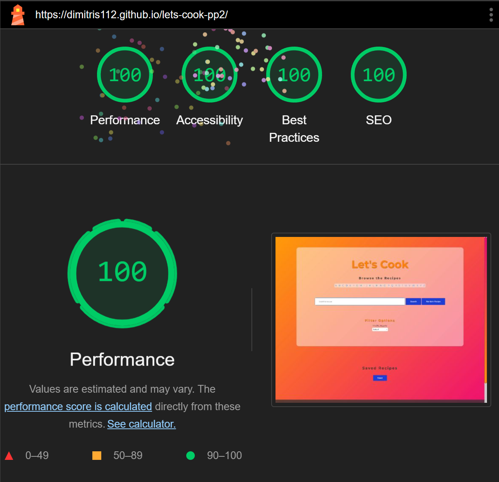

# Let's Cook
Go to the website -> [Live link](https://dimitris112.github.io/lets-cook-pp2/ "target=_blank")

- ## [Purpose of the project](#purpose-of-the-project)
- ## [User Stories](#user-stories)
    - [First Timer](#first-timer)
    - [Frequent user](#frequent-user)
- ## [Features](#features)
    - [Implemented Features](#implemented-features)
    - [Future Features](#future-features)
- ## [Typography and color scheme](#typography-and-color-scheme)
- ## [Technology](#technology)
    - [Languages](#languages)
    - [Tools](#tools)
    - [API](#api)
- ## [Testing](#testing)
    - [Code Validation](#code-validation)
    - [Test cases](#test-cases)
    - [Fixed bugs](#fixed-bugs)
    - [Unfixed bugs](#unfixed-bugs)
    - [Supported screens and browsers](#supported-screens-and-browsers)
- ## [Deployment](#deployment)
    - [Gitpod](#via-gitpod)
    - [Github Pages](#via-github-pages)
- ## [Credits](#credits)
    - [General](#general)
    - [Media](#media)

# Purpose of the project
- The purpose of the project is a website called "Let's Cook" that serves as a recipe finder. The project aims to provide users with a platform to search, browse, and discover recipes based on various criteria such as keywords, categories, and alphabetical order. Additionally, users can save locally their favorite recipes for future reference.

## User stories
- As a food explorer, I want to try recipes from different cultures and regions to expand my knowledge in gastronomy.
- As a food enthusiast, I want to explore recipes from different cuisines and categories.
- As a busy individual, I want to be able to search recipes based on specific ingredients or keywords so that I can quickly find recipes that match my available ingredients or dietary preferences. This feature would save me time and help me make the most out of my limited cooking time.
- As someone passionate about cooking, I want to have a functionality to save recipes that I find intriguing or unique, empowering me to experiment with new flavors and techniques at my own pace.
- As an extrovert who loves food and cooking, I'd like to share on my social media the recipes I find fancy.

### First Timer
 - As a first time visitor to the website, I want a clear and intuitive interface that guides me through the recipe discovery process.
 - As someone new to cooking, I want easy access to beginner-friendly recipes with simple instructions and common ingredients.
 - As a single individual cooking for myself, I want recipes that are portioned for one or two servings, preventing food waste and allowing me to enjoy a variety of meals without leftovers.

### Frequent User
 - As a seasoned home cook, I want the ability to save my own recipes and share them with the community, showcasing my culinary creations and inspiring others.
 - As an amateur chef, I want access to a variety of recipes ranging from simple everyday meals to gourmet dishes, allowing me to continuously improve my cooking skills and experiment with different ingredients and cooking techniques.
 - As a meal planner, I want to find recipes that can be easily customized and adapted to suit my family's preferences, dietary restrictions, and ingredient availability, empowering me to create personalized meal plans and grocery lists for the week ahead.

## Features
  ### Implemented Features 
  - Users can easily navigate through recipes **[alphabetically](#alphabetical-search)** by selecting a letter, instantly filtering the displayed recipes to those beginning with the chosen letter.
  - Users can discover new and exciting recipes by clicking the **[Random Recipe](#random-recipe)** button, which selects a recipe at random from the mealdb API providing an element of surprise.
  - Users can refine their recipe search based on specific meal **[categories](#filter-category)** via a dropdown menu, which provides a list of available food categories to choose from.
  - The project includes clean **[pagination](#pagination)** functionality, ensuring a smooth browsing experience by displaying up to 4 recipes per page. Pagination controls such as `Previous` and `Next` buttons enable the user to navigate between pages.
  - Users can save each recipe they desire by clicking the `Save Recipe` button which then will be stored below the **[Saved Recipes](#saved-recipes)**. To manage their saved recipes, users have the flexibility to either remove individual recipes by clicking the `Remove` button or clear their entire saved collection with a single click on the `Reset` button. Moreover the `Save Recipe` button is hidden within the details of recipes that are already saved, which ensures that the users are not overwhelmed with unnecessary options. When the user saves the recipe for the first time, an alert will pop displaying **Recipe saved successfully!**, if it's clicked again it will be displayed as **Recipe already saved!**.
  - The project includes a **[Toggle Speech](#toggle-speech)** button which will read aloud the details of the recipe once the user has clicked to view one. It's easily accessible since its below the `Save Recipe` button. The speech can be ended in 2 ways. The first is by clicking the `Toggle Speech` button a second time and the second is when the user exits the recipe details window either by clicking the X button or just by clicking out of it. This feature enhances accessibility, catering to users who may benefit from auditory assistance.
  - Users can share their favorite recipes with friends and followers through their **[Social Media](#social-media-sharing)**.
  - The project includes it's own **[error 404 page](#error-404-page)** for when the user clicks on something broken, which will guide him back to **homepage**.
  - On the **[footer](#footer)** I've included a visually appealing spherical pulse effect housing my 2 social icons which lead to this **Github repository** and my [Linkedin](https://www.linkedin.com/in/dimitrios-thlivitis-617492300/ "target=_blank") profile.

  - ### ***DISCLAIMER***
    - The speech which reads the details of the recipes works **ONLY** in browsers that include `Web Speech API`. Click here for more information -> [WebSpeech API](https://developer.mozilla.org/en-US/docs/Web/API/Web_Speech_API "target=_blank")
 
    - The **[scrollbar](#scrollbar)** effects / colors will be visible **ONLY** to browsers that include the `::-webkit-scrollbar`. Here's the link for more information -> 
 [Webkit Scrollbar](https://developer.mozilla.org/en-US/docs/Web/CSS/::-webkit-scrollbar "target=_blank")

    - Saved recipes will be saved **ONLY** locally in the browser (computer or mobile) as for now the project lacks back-end services.

 ### Future Features
  - Add the option for users to search recipes by *Area* just like they can search by meal category.
  - Implement user authentication with sign-up / login functionality once back-end services are introduced, enabling users to leave comments and ratings on their favorite recipes.
  - Enable voice search functionality enabling users to search recipes by simply speaking, providing a convenient user experience.

## Typography and color scheme
- The project utilizes the **Montserrat** font family from Google Fonts, while the primary font is Montserrat / the fallback font is Sans-serif. As for the color scheme for the body `background: linear-gradient(135deg, #ff9a00, #ee0979);` it ensures a vibrant orange for primary color `"ff9a00"` and bold pink for the secondary color `"ee0979"` while the `linear-gradient of 135deg` let's it flow diagonally from the bottom left to the top right with a value of 135degrees creating a smooth color change. Furthermore buttons, headings and images are enhanced with effects like text shadow / box shadow adding depth and dimension.

## Technology
- ### ***Languages*** 
  - **HTML** Used for structuring the web page.
  - **CSS** Used for styling the web page making it visually appearing.
  - **JavaScript** Used for adding interactivity for the user and dynamic behavior to the web page.
- ### ***Tools***
  - **Git** Used for version control eg. **`git`** `add - commit - push`
  - **Github** Used as the hosting platform for the repository.
  - **Github Pages** Used for deploying the webpage.
  - **Gitpod** Used as the IDE for writing, editing and debugging code.
  - [**Favicon**](https://favicon.io/ "target=_blank") Used for generating the favicon.
  - [**Font awesome**](https://fontawesome.com/ "target=_blank") Used for the social icons in the footer.
  - [**Am I Responsive**](https://ui.dev/amiresponsive?url=https://dimitris112.github.io/lets-cook-pp2/ "target=_blank") Used for checking the responsiveness of the website.
  - [**Lighthouse**](https://chromewebstore.google.com/detail/lighthouse/blipmdconlkpinefehnmjammfjpmpbjk "target=_blank") Used for checking the score for the page through Google Chrome's dev tools on incognito mode, specifically I did 2 metrics `before` and `after` some minor changes, added `aria-label` and invisible `h5` to the footer. Click here to view the screenshot [before](#before) and [after](#after)
- ### ***API***
  - Recipe data was obtained from the **[Mealdb API](https://www.themealdb.com/api.php)** using asynchronous functions. 

## Testing
 - ### Code Validation
   - For the **HTML** validation I used [w3](https://validator.w3.org/ "target=_blank") which shows the [page](https://validator.w3.org/nu/?doc=https%3A%2F%2Fdimitris112.github.io%2Flets-cook-pp2%2F "target=_blank") error free. 
   - For the **CSS** I used the same method which is also error free but received warnings about the `::-webkit-scrollbar` because it is not universal among the browsers. See for yourself -> [CLICK ME](https://jigsaw.w3.org/css-validator/validator?uri=https%3A%2F%2Fdimitris112.github.io%2Flets-cook-pp2%2F&profile=css3svg&usermedium=all&warning=1&vextwarning=&lang=en "target=_blank")
   - For the **JavaScript** I used 

 - ### Test cases
      - ### Alphabetical Search
       
        The user explores recipes alphabetically by clicking on each letter. If there are no recipes starting with the selected letter, a message will appear below the search bar stating `No recipes found.`

      

      **[Go back to implemented features](#implemented-features)**

      - ### Random Recipe
       
        By clicking the `Random Recipe` button, the user will be prompted with a window from a random picked recipe across any category and area.

      

      **[Go back to implemented features](#implemented-features)**

      - ### Filter Category 

        The filter category dropdown menu helps the user to pick quickly his choice of meal / recipe. It contains 14 categories to choose from, on **mobile phones and tablets** this feature instead of the dropdown menu, prompts a new selection menu.

      

      **[Go back to implemented features](#implemented-features)**
      

      - ### Pagination

        The user will come across 4 recipes per page and with the help of the `previous` and `next` button will navigate through the pages. In small mobile screens although the user sees 4 recipes per page, ***but*** they are aligned vertically 1 by 1.

      
      
      **[Go back to implemented features](#implemented-features)**

      - ### Saved Recipes 

        The user can save his recipes locally by clicking the `Save Recipe` button in the modal display, then every recipe stored in the browser will be shown below with its name and having the `Remove` button in its right to remove it from the list. Above the first saved recipe, there is the `Reset` button which clears the list of the saved recipes. If the user clicks the button to save the recipe, an alert will pop indicating the user that it's `Recipe saved successfully!`, if it's clicked again a new alert will pop with the message of `Recipe already saved!`

        
      
      **[Go back to implemented features](#implemented-features)**

      - ### Toggle Speech

        The user can click the `Toggle speech` button which then reads the instructions of the recipe by using the `Web Speech API` which is not universal amongst browsers, the button is found only inside the modal content of the recipe and acts as an extra help for users who have issues with their vision. The speech can be terminated by 2 ways. First the user clicks the button again. Second, the user exits the modal display content or clicks the **X** button.

      

      **[Go back to implemented features](#implemented-features)**

      - ### Scrollbar 

        The user can experience some fancy scrolling effects. Just that.

      
      
      **[Go back to implemented features](#implemented-features)**

      - ### Social Media Sharing 

        The user can share his favorite recipe in one or all of the three social media below, including via e-mail as the fourth. By clicking each button, he will be lead to a new tab in his browser where he can simply click the "share button" of each platform or in the case of the e-mail, the subject and body of the mail is autocompleted.

      

      **[Go back to implemented features](#implemented-features)**

      - ### Error 404 Page 

        What page? This page doesn't exist, it's 404. Ok jokes aside, this page acts as the "border" of the website for when the user clicks on something broken, then he can simply click back to `homepage`.

      

      **[Go back to implemented features](#implemented-features)**

      - ### Footer 

        On the footer, the user looks on some visually appealing sphere effect and when he hovers over it or click on it if he's on phone/tablet. He can see the **[Github](https://github.com/Dimitris112/lets-cook-pp2)** repository and my **[Linkedin Profile](https://www.linkedin.com/in/dimitrios-thlivitis/)**. Both links open in a new tab for the best user experience. Also there is the `Created by Dimitris 2024` below the icons, which `Dimitris` is me and the `2024` is the year of building this project.

      

      **[Go back to implemented features](#implemented-features)**

      - ### Metrics 
      
        Using the Lighthouse metrics score on Chrome's devtools, on incognito mode managed to increase the accessibility score from **87** to **100**. The rest of the metrics remain the same as **100**.

      - #### Before ####

       

      - #### After ####

      

      **[Go back to implemented features](#implemented-features)**

 - ### Fixed bugs
   - Fixed an issue with the save recipe button not storing the recipes locally in the browser by updating the JavaScript code so when the user clicks it, it will be stored no matter if the browser is closed or refreshed,
  added an error handling to manage issues during the saving or retrieval process.
   - Removed the horizontal scrollbar when the user would hover over the saved recipes, which led to bad zoom in-out effects.
   - Fixed the pagination of the recipes to always start on page 1 and the pagination control buttons `previous - next` to keep searching when the user clicks them.
   - Fixed the meal category dropdown menu to show the correct category when the user selects it by adding an event listener to it and adjusting the functions responsible for fetching the recipes. Both asynchronous and non async.
   - Fixed a minor issue with the save recipe button not reappearing after viewing an already saved recipe, just by updating the function which displays the recipe details.
   - Fixed the speech to stop whenever the user exits the recipe details window.
   - Fixed the issue where the user would type anything in the search bar and it would be there no matter what.
   - Fixed the error which led the user to `infinite` 404 page landing if he used `/` after the **index.html** and then kept typing.
    

 - ### Unfixed bugs
 
 - ### Supported screens and browsers
   - **Responsive Design:** The website is fully responsive and optimized for all screen sizes, ensuring seamless browsing experience. From the compact *Samsung Galaxy Fold* with a width as small as 280px up to large PC monitors.
   - **Browser Compatibility:** The website is compatible with all up to date browsers, ensuring a consistent experience for users across different platforms. However there are some minor variations in the visuals on certain browsers. For more information refer to the above -> [disclaimer](#disclaimer)
## Deployment
 - ### Via Gitpod
  1. Head over to [Gitpod](https://www.gitpod.io/ "target=_blank") and click the ***Login*** button, it's located at the top right corner, if you can't see it click the **`=`** dropdown menu and then login. There will be 3 options.
   - Continue with **GitLab**.
   - Continue with **GitHub**.  "prefer this one"
   - Continue with **Bitbucket**.
  2. Click to login or register with your preferred option.
  3. Now click on ***Dashboard*** which is located near the top right corner, again if you can't see it click the **`=`** button which will display a dropdown menu.
  4. <ins>***BEFORE***</ins> you proceed further you have to create your repository in your **Github**  profile or what was your choosing. Find more information here -> [Github repository](https://docs.github.com/en/repositories/creating-and-managing-repositories/quickstart-for-repositories "target=_blank")
  5. Once you're in, you will see the ***Workspaces*** screen. Click `New Workspace` and select the repository you created in your **Github profile** or any of the platform you chose. You can choose an **IDE** "Integrated Development Environment" of your liking. Below that there will be an option for you to choose, based on your system `Standard` or `Large`. Make sure to select the correct repository from the list presented in the Gitpod interface.
  6. Afterwards Gitpod will start initializing your workspace based on your repository, this may take a moment.
  7. Once the process is complete, you'll be inside the **Gitpod IDE**.

 - ### Via Github pages
  1. Before you do anything, make sure in your repository you've included an `index.html` and `README.md` file.
  2. Now once you've done the 1st step, your next move is to navigate to your repository ***Settings*** located near the top left corner. If you cannot see the ***Settings*** tab, click the `...` dropdown menu and select it.
  3. In the ***Code and Automation*** section , click ***Pages***
  4. Under the **Build and Deployment** you can deploy from a *branch*. You have to select **main** as your branch and `/root` as your folder. Then click **save**
  5. <ins>***OPTIONAL***</ins> you can create your custom domain if you want to.
  6. The URL for the page takes some time to be created, once it's done it will be displayed at the top. In the meantime, find something to cook!

## Credits

- ### General
  - When I was thinking of building a recipe finder website, I searched here and there for some information on how to implement the key functions for the recipes etc and landed on using the [mealDB](https://www.themealdb.com/ "target=_blank"). Used only the free version of its API.
  - Rohit Sharma - My mentor.
  - Code Institute's slack community.

- ### Media
  - I got the idea for the scrollbar effects from this video -> [How to Web Dev](https://www.youtube.com/watch?v=rjYo5YUA2fU "target=_blank")
